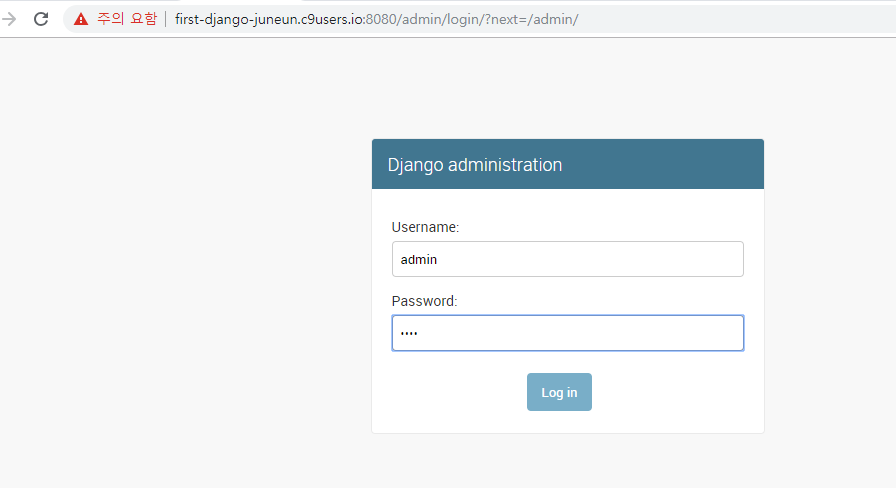

## Django Model

**공식문서** : https://docs.djangoproject.com/ko/2.1/topics/db/models/


---

**c9 project ==> first_django**

```
$ mkdir ORM
$ cd ORM/
$ pyenv virtualenv 3.6.7 orm-venv
$ pyenv local orm-venv
$ pip install django
$ django-admin startproject orm .
$ python manage.py startapp articles  
```

---

**settings.py**

```python
ALLOWED_HOSTS = ["first-django-juneun.c9users.io"]
INSTALLED_APPS = [
    'django.contrib.admin',
    'django.contrib.auth',
    'django.contrib.contenttypes',
    'django.contrib.sessions',
    'django.contrib.messages',
    'django.contrib.staticfiles',
    'articles',   # 'articles.apps.ArticlesConfig',써도 됨! 
]
```


**models.py**

```python
from django.db import models

# Create your models here.
class Article(models.Model):  # class 이름이 tablename으로 자동으로 됨
    title = models.TextField()  # models.CharField()로 해도 됨
    content = models.TextField()   
```

---

### make migrations@!

`$ python manage.py makemigrations`

`$ python manage.py migrate`

`$ python manage.py shell`          -> shell에서 명령

> `>>> from articles.models import Article`   				   
>
> `>>> article = Article(title="Happy", content="Python")`   # data넣기
>
> `>>> article.save()`
>
> `>>> articles = Article.objects.all()`
>
> `>>> a = articles[0]`
>
> `>>> a.title`      			  -> 'Happy' 출력
>
> `>>> a.content`   		  -> 'Python' 출력


**filter**

`>>> a = Article.objects.filter(title="Happy").first()`

> `>>> a.title` : 'Happy'
>
> `>>> a.content` : 'Python'


**get**

`>>> b = Article.objects.get(pk=1)`

> `>>> b.title`  : 'Happy'
>
> `>>> b.content`: 'SSAFY'


**detele**

`>>> b.delete()`

> 확인
>
> `>>> len(Article.objects.all())`     **: 1**

또 지워보기

> `>>> a2 = Article.objects.get(pk=2)`
>
> `>>> a2.delete()`
>
> `>>> len(Article.objects.all())`      **: 0**


**update**

```
>>> article = Article(title="제목얍", content="내용얍")
>>> article.save()
>>> article = Article(title="제목22", content="내용22")
>>> article.save()
>>> articles = Article.objects.all()                             >>> articles[0]                 
    	<Article: Article object (3)>
>>> Article.objects.get(title="제목얍")
    	<Article: Article object (3)>
```

> `>>> article = Article.objects.get(title="제목얍")`
>
> `>>> article.title = "바꾼제목"`
>
> `>>> article.save()`
>
> `>>> article.title`      **: "바꾼제목"**

```
>>> Article.objects.get(pk=4).content
 		'내용22'
```

---

---

### # admin

**admin.py**

```python
from django.contrib import admin
from .models import Article    # 현재폴더의 models.py의 Article
# Register your models here.

admin.site.register(Article)
```

---

`$ python manage.py createsuperuser`


---




관리자 페이지!


---

**admin.py**

```python
from django.contrib import admin
from .models import Article    # 현재폴더의 models.py의 Article
# Register your models here.

class ArticleAdmin(admin.ModelAdmin):
    list_display = ('title', 'content',)
    
admin.site.register(Article, ArticleAdmin)
```

**[컬럼명이 보여짐!]**


---

## `__str__`

**models.py**

```python
from django.db import models

# Create your models here.
class Student(models.Model):  # class 이름이 tablename으로 자동으로 됨
    name = models.CharField(max_length=25)  
    email = models.CharField(max_length=25)  
    birthday = models.DateField()  
    age = models.IntegerField()     
    
    def __str__(self):
        return f"이름 : {self.name}, 나이 : {self.age}, 생일 : {self.birthday}, 이메일 : {self.email}"
```


