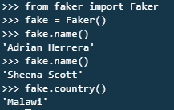
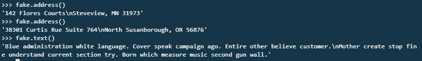
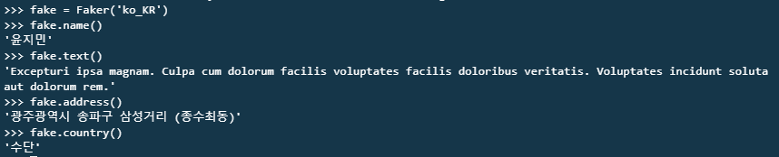

## 운명 앱 만들기

**c9 - first_django workspace**

**server 실행** :  `python manage.py runserver $IP:$PORT`

```
$ mkdir BONBON
$ cd BONBON/
$ pyenv virtualenv 3.6.7 bonbon-venv
$ pyenv local bonbon-venv 

$ pip install django
$ django-admin startproject bonbon .
$ python manage.py startapp pastlife

$ pip install faker
```

---

### faker

https://faker.readthedocs.io/en/latest/index.html







---

구성 : 

'/' : 사용자의 이름을 입력받아 -> '/pastlife' 로 넘겨줌

'/pastlife' -> **님의 전생은 ##였습니다. (faker를 통한 가짜 직업 보여주기)

---

**settings.py**

```python
ALLOWED_HOSTS = ['*']

INSTALLED_APPS = [
    'django.contrib.admin',
    'django.contrib.auth',
    'django.contrib.contenttypes',
    'django.contrib.sessions',
    'django.contrib.messages',
    'django.contrib.staticfiles',
    'pastlife',
]
```

**views.py**

```python
def index(request):
    return render(request, 'index.html')
```

**urls.py**

```python
from django.contrib import admin
from django.urls import path

from pastlife import views 

urlpatterns = [
    path('admin/', admin.site.urls),
    path('', views.index)
]
```

---

**pastlife/templates/index.html**

```html
<h1>전생앱~</h1>
<p>전생을 알려드립니다.</p>
<form action="/pastlife">
    <input type="text" name="name"/>
    <input type="submit" value="Submit"/>
</form>
```

**pastlife.html**

```html
<h1>{{name}}</h1>
<h2>{{fake_job}}</h2>
```

**urls.py**

```python
path('pastlife/', views.pastlife),
```

**views.py**

```python
from faker import Faker
def pastlife(request):
    # 이름을 받아, faker를 통해 가짜 데이터를 만들어 같이 보냄!
    name = request.GET.get('name')
    fake_job = Faker('ko_KR').job()
    return render(request, 'pastlife.html', {"name":name, "fake_job":fake_job})
```

---


