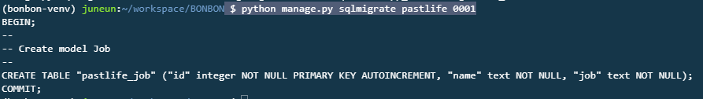

## DB 연결

**models.py**

```python
from django.db import models

# Create your models here.
class Job(models.Model):
    name = models.TextField()
    job = models.TextField()
```

---

`$ python manage.py makemigrations`   

`$ python manage.py sqlmigrate`      : 실제 어떤 sql이 나왔는지

> 

`$ python manage.py migrate`

> table 확인 : table 이름 default(app이름_class이름)
>
> 

---


---

`$ python manage.py shell ` :  장고 쉘 실행!

> ```shell
> >>> from pastlife.models import Job
> >>> Job.objects.all()
> <QuerySet []>
> >>> j = Job(name="이정은", job="개발")
> >>> j.save()
> >>> Job.objects.create(name="이정은2", job="개발2")
> <Job: Job object (2)>
> >>> Job.objects.all()
> <QuerySet [<Job: Job object (1)>, <Job: Job object (2)>]>
> >>> Job.objects.first().name
> '이정은'
> >>> Job.objects.first().job
> '개발'
> >>> Job.objects.all()[1].name
> '이정은2'
> >>> Job.objects.all()[1].job
> '개발2'
> ```

### **repr 설정**

**models.py**

```python
from django.db import models

# Create your models here.
class Job(models.Model):
    name = models.TextField()
    job = models.TextField()
    
    def __repr__(self):
        return f"{self.name} : {self.job}"
        
```

`$ python manage.py shell`

> ```shell
> >>> from pastlife.models import Job
> >>> Job.objects.all()
> <QuerySet [이정은 : 개발, 이정은2 : 개발2]>
> >>> print(Job.objects.first())
> Job object (1)
> ```

### **str 설정**

**models.py**

```python
from django.db import models

# Create your models here.
class Job(models.Model):
    name = models.TextField()
    job = models.TextField()
    
    def __repr__(self):
        return f"<{self.name} : {self.job}>"
    
    def __str__(self):
        return f"<{self.name} : {self.job}>"
     
```

`$ python manage.py shell`

> ```shell
> >>> from pastlife.models import Job
> >>> print(Job.objects.first())
> <이정은 : 개발>
> 
> >>> Job.objects.get(name="이정은")
> <이정은 : 개발>
> >>> Job.objects.get(name="이정")               # ERROR!!!!
> Traceback (most recent call last):
>   .....
>   
> >>> Job.objects.filter(name="이정은").first()
> <이정은 : 개발>
> >>> Job.objects.filter(name="이정").first()    # NONE
> >>> person = Job.objects.filter(name="이정").first()
> >>> print(person)
> None
> 
> >>> person2 = Job.objects.filter(name="이정은").first()
> >>> print(person2)
> <이정은 : 개발>
> ```

---


---

**views.py**

```python
from django.shortcuts import render
from faker import Faker
# from pastlife.models import Job #현재 같은 레벨에 있음
from .models import Job

# Create your views here.
def index(request):
    return render(request, 'index.html')
    
def pastlife(request):
    # 이름을 받아, faker를 통해 가짜 데이터를 만들어 같이 보냄!
    name = request.GET.get('name')
    
    # 만약 해당 이름이 DB에 저장되어 있다면, 그 직업을 가져옴
    # (DB에서 해당 이름의 레코드가 있는지 찾아본다)!
    # 없으면, faker를 통해 DB에 추가하고, 그 값을 가져옴
    
    person = Job.objects.filter(name=name).first() # 칼럼name = 받은값name 인지 # 아래 코드와 같음!
    # person = Job.objects.get(name=name)
    if person : # None이 아니면,
        job = person.job
    else:
        job = Faker('ko_KR').job()
        new_person = Job(name=name, job=job)
        new_person.save()
        
    
    context =  {"name":name, "job":job}
    
    return render(request, 'pastlife.html', context)
```


---

GIPHY

https://developers.giphy.com/

**Create an App**


-> Api Key 발급! XbeILYzR9qPyB79*****************


> ##### HOST
>
> api.giphy.com
>
> ##### PATH
>
> GET/v1/gifs/search
>
> ==> api.giphy.com/v1/gifs/search?api_key=XbeILYzR9qPyB79JL4I7uo2CQXj3XPms&q=doctor&limit=1&lang=ko
>
> > 
> >
> > => original -> url!!!!!!!

**views.py**

`pip install requests`

```python
from django.shortcuts import render
from faker import Faker
# from pastlife.models import Job #현재 같은 레벨에 있음
from .models import Job
import os
import requests
import json

# Create your views here.
def index(request):
    return render(request, 'index.html')
    
def pastlife(request):
    # 이름을 받아, faker를 통해 가짜 데이터를 만들어 같이 보냄!
    name = request.GET.get('name')
    
    # 만약 해당 이름이 DB에 저장되어 있다면, 그 직업을 가져옴
    # (DB에서 해당 이름의 레코드가 있는지 찾아본다)!
    # 없으면, faker를 통해 DB에 추가하고, 그 값을 가져옴
    
    person = Job.objects.filter(name=name).first() # 칼럼name = 받은값name 인지 # 아래 코드와 같음!
    # person = Job.objects.get(name=name)
    if person : # None이 아니면,
        job = person.job
    else:
        job = Faker('ko_KR').job()
        new_person = Job(name=name, job=job)
        new_person.save()
     
    # gif
    GIPHY_KEY = os.getenv('GIPHY_KEY')
    
    url = "http://api.giphy.com/v1/gifs/search?api_key={}&q={}&limit=1&lang=ko".format(GIPHY_KEY,job)
    response = requests.get(url).json()
    img_url = response.get("data")[0].get("images").get("original").get("url")
    
    context =  {"name":name, "job":job, "img_url":img_url}
    
    return render(request, 'pastlife.html', context)
```


