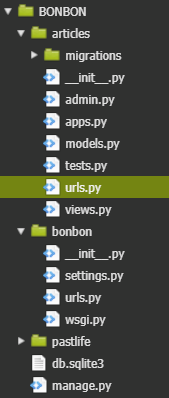
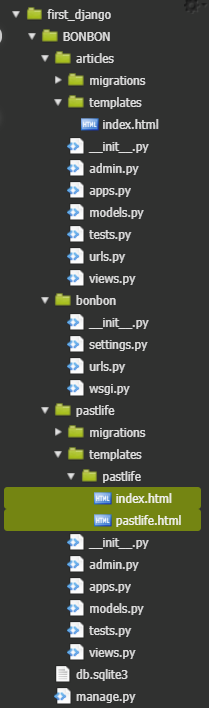
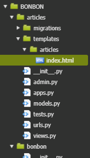

## 게시판

`$ python manage.py startapp articles`

 /articles          -> 모든 글을 보여주는 곳
 /articles/1        -> 글 상세하게 보는 곳
 /articles/new      -> 새 글 작성
 /articles/create   -> 새 글 저장
 /articles/1/edit   -> 글 편집
 /articles/1/update -> 글 수정
 /articles/1/delete -> 글 삭제 

**settings.py**

```python
INSTALLED_APPS = [
    'django.contrib.admin',
    'django.contrib.auth',
    'django.contrib.contenttypes',
    'django.contrib.sessions',
    'django.contrib.messages',
    'django.contrib.staticfiles',
    'pastlife',
    'articles',  # 앱 추가
]
```

---

### **urls.py 분리! articles/urls.py 만들기**




**bonbon/urls.py**   : main 문지기

```python
from django.contrib import admin
from django.urls import path, include

from pastlife import views 

urlpatterns = [
    path('admin/', admin.site.urls),
    path('', views.index),
    path('pastlife/', views.pastlife),
    path('articles/', include('articles.urls')),
]

```

**articles/urls.py**   : sub 문지기

```python
from django.urls import path
from . import views 

urlpatterns = [
    path('', views.index),
    path('<int:id>/', views.detail),
    path('new/', views.new),
    path('create/', views.create),
    path('<int:id>/edit/', views.edit),
    path('<int:id>/update/', views.update),
    path('<int:id>/delete/', views.delete),
    
]
```

**views.py**

```python
from django.shortcuts import render

def index(request):
    return render(request, 'index.html')
```


### --> templates이 적용 안돼. -> 폴더 구조 바꾸기



**pastlife/view.py** 수정

```python
def index(request):
    return render(request, 'pastlife/index.html')
...
...
def pastlife(request): 
    return render(request, 'pastlife/pastlife.html', context)
```




**views.py**

```python 
def index(request):
    return render(request, 'articles/index.html')
```

===> template 적용 됨 ^^


