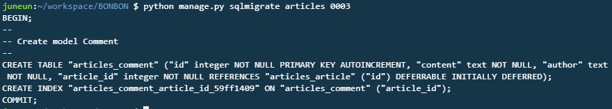
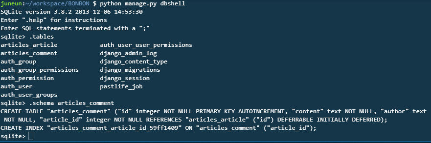
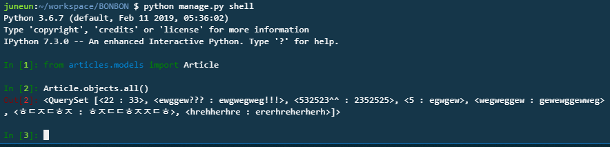
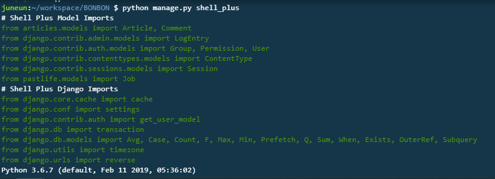
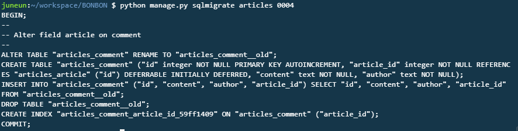

c9 - first_django

BONBON

**articles/models.py**

```python
from django.db import models

# Create your models here.
class Article(models.Model):
    title = models.TextField()
    content = models.TextField()
    
    def __repr__(self):
        return f"<{self.title} : {self.content}>"
    
    def __str__(self):
        return f"<{self.title} : {self.content}>"
        
class Comment(models.Model):
    content = models.TextField()
    author = models.TextField()
    article = models.ForeignKey(Article, on_delete=models.CASCADE) # 게시글 삭제시 댓글 같이 삭제
    
    def __repr__(self):
        return f"<{self.author} : {self.content}>"
    
    def __str__(self):
        return f"<{self.author} : {self.content}>"
    
```

---

`$ python manage.py makemigrations`

` $ python manage.py migrate`

`$ python manage.py sqlmigrate articles 0003`     :  정보 확인 

> 

` $ python manage.py dbshell`        :  지금 내가 갖고있는 실제 db의 shell을 보여줌

> 

`$ python manage.py shell`      : python console

> ```shell
> from articles.models import Article
> Article.objects.all()
> ```

---

**extensions** : `$ pip install django_extensions ipython`

**settings.py**

```python
INSTALLED_APPS = [
    'django.contrib.admin',
    'django.contrib.auth',
    'django.contrib.contenttypes',
    'django.contrib.sessions',
    'django.contrib.messages',
    'django.contrib.staticfiles',
    'pastlife',
    'articles',
    'django_extensions', 
]
```

> 

---

댓글 테이블 shell에서 사용해보기

```
from aritcles.models import Article
from articles.models import Comment
...
...
```

**매번 할때마다 import하지 않기**       `$ python manage.py shell_plus`

> 자동으로 import 됨
>
> 

**첫번재 글에 댓글 남기기**

```powershell
In [2]: article1 = Article.objects.get(id=25)      

In [3]: article1                                  
Out[3]: <25번글, 22 : 33>

In [4]: comment = Comment(content="첫댓글",author="첫글쓴", article="article1")  

In [5]: comment = Comment(content="첫댓글",author="첫글쓴", article=article1)                                           

In [6]: comment.save()                       

In [7]: comment                                              
Out[7]: <첫글쓴 : 첫댓글>

In [8]: Comment.objects.all()     
Out[8]: <QuerySet [<첫글쓴 : 첫댓글>]>

In [9]: Comment.objects.first()     
Out[9]: <첫글쓴 : 첫댓글>

In [10]: Comment.objects.first().content         
Out[10]: '첫댓글'

In [11]: Comment.objects.first().author      
Out[11]: '첫글쓴'

## 속한 게시글로도 갈 수 있음!
In [12]: Comment.objects.first().article           
Out[12]: <25번글, 22 : 33>

## 속한 게시글의 정보도 뽑을 수 있음!
In [13]: Comment.objects.first().article.content        
Out[13]: '33'

In [14]: Comment.objects.first().article.title         
Out[14]: '22'

# 게시글 입장에서도 댓글을 조회할 수 있음
In [16]: Article.objects.first().comment_set.all()        
Out[16]: <QuerySet [<첫글쓴 : 첫댓글>]>
```

**두번째 글에 댓글 달기**

```powershell
In [17]: comment = Comment(content="두번째의 첫댓글!", author="두번째의 첫 글쓴", article=Article.objects.all()[1])     

In [18]: comment.save()  

In [19]: comment                                    
Out[19]: <두번째의 첫 글쓴 : 두번째의 첫댓글!

In [20]: Comment.objects.all()                      
Out[20]: <QuerySet [<첫글쓴 : 첫댓글>, <두번째의 첫 글쓴 : 두번째의 첫댓글!>]>

In [21]: Comment.objects.all()[1]                    
Out[21]: <두번째의 첫 글쓴 : 두번째의 첫댓글!>

In [22]: Comment.objects.all()[1].article            
Out[22]: <26번글, ewggew??? : ewgwegweg!!!>

In [23]: Comment.objects.all()[1].article_id        
Out[23]: 26

In [25]: Comment.objects.all()[1].article.title           
Out[25]: 'ewggew???'

In [26]: Comment.objects.all()[1].article.content        
Out[26]: 'ewgwegweg!!!'
```

---

## 같은 명령어를 줄여줌!

`Comment.objects.all()[1].article `   == `Article.objects.get(pk=Comment.objects.all()[1].article_id)`

---

`Article.objects.first().comment_set.all() ` ==

`Comment.objects.filter(article_id=Article.objects.first().id).all()  `

---

### .comment_set.all()을 직관적으로 바꾸기

### > related_name

**models.py**

```python
from django.db import models

# Create your models here.
class Article(models.Model):
    title = models.TextField()
    content = models.TextField()
    
    def __repr__(self):
        return f"<{self.id}번글, {self.title} : {self.content}>"
    
    def __str__(self):
        return f"<{self.id}번글, {self.title} : {self.content}>"
        
class Comment(models.Model):
    content = models.TextField()
    author = models.TextField()
    article = models.ForeignKey(Article, on_delete=models.CASCADE, related_name="comments" ) 
    
    def __repr__(self):
        return f"<{self.author} : {self.content}>"
    
    def __str__(self):
        return f"<{self.author} : {self.content}>"
```

> **항상 models.py 파일을 변경하면**
>
> `$ python manage.py makemigrations`
>
> 

` $ python manage.py shell_plus`

> ```powershell
> # Article.objects.first().comment_set.all()를 아래로 쓸 수 있음
> In [2]: Article.objects.first().comments.all()           
> Out[2]: <QuerySet [<첫글쓴 : 첫댓글>]
> ```

---


---

**app에 적용해보기**

**urls.py**

```python
from django.urls import path
from . import views 

app_name = 'articles'

urlpatterns = [
    path('', views.index, name='index'),
    path('new/', views.new, name='new'),
    path('<int:aid>/', views.detail, name='detail'),
    path('create/', views.create, name='create'),
    path('<int:aid>/edit/', views.edit, name='edit'),
    path('<int:aid>/update/', views.update, name='update'),
    path('<int:aid>/delete/', views.delete, name='delete'),
    path('<int:aid>/comment/', views.comment, name='comment'),
]
```


