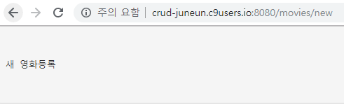
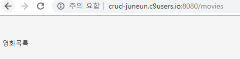

# orm crud review

`$ sudo pip3 install flask flask-sqlalchemy`

`$ flask run --host=0.0.0.0 --port=8080`

### c9 project-crud

---

**app.py**

```python
from flask import Flask, render_template, request
from flask_sqlalchemy import SQLAlchemy

app = Flask(__name__)

app.config['SQLALCHEMY_DATABASE_URI'] = 'sqlite:///test.db'
app.config['SQLALCHEMY_TRACK_MODIFICATIONS'] = False

db = SQLAlchemy(app)

db.init_app(app)

# Movie라고 하는 테이블 생성
class Movie(db.Model):
    __tablename__ = "movies"
    __table_args__ = {"sqlite_autoincrement":True}
    id = db.Column(db.Integer, primary_key=True)
    title = db.Column(db.String, unique=True, nullable=False)
    title_en = db.Column(db.String, nullable=False)
    audience = db.Column(db.Integer, nullable=False)
    open_date = db.Column(db.String, nullable=False)
    genre = db.Column(db.String, nullable=False)
    watch_grade = db.Column(db.String, nullable=False)
    score = db.Column(db.Float, nullable=False)
    poster_url = db.Column(db.String, nullable=False)
    description = db.Column(db.String, nullable=False)
    
    def __repr__(self):
        return "<Movie {}: {}>".format(self.id, self.title)
        
db.create_all()

@app.route('/')
def index():
    return render_template("index.html")
```


---

## html extends

**base.html**

```html
<!DOCTYPE html>
<html lang="en">
<head>
    <meta charset="UTF-8">
    <meta name="viewport" content="width=device-width, initial-scale=1.0">
    <meta http-equiv="X-UA-Compatible" content="ie=edge">
    <!-- 합쳐지고 최소화된 최신 CSS -->
    <link rel="stylesheet" href="https://maxcdn.bootstrapcdn.com/bootstrap/3.3.2/css/bootstrap.min.css">
    <!-- 부가적인 테마 -->
    <link rel="stylesheet" href="https://maxcdn.bootstrapcdn.com/bootstrap/3.3.2/css/bootstrap-theme.min.css">
    <!-- 합쳐지고 최소화된 최신 자바스크립트 -->
    <script src="https://maxcdn.bootstrapcdn.com/bootstrap/3.3.2/js/bootstrap.min.js"></script>
    <title>Document</title>
</head>
<body>
    
    
</body>
</html>
```


**index.html**

```html


영화목록

```

**new.html**

```html


새 영화등록

```





**공통 템플릿에 각각 조건 적용!**

---

**base.html**

```html
...
<body>
    
    
    <hr>
    
    
</body>
...
```

**index.html**

```html



<h1>영화목록</h1>



<p>영화 리스트~</p>

```

---

---


## form 값 한번에 받기 **request.args

**new.html**

```html



<h1>영화 추가하기</h1>



<p>영화를 추가해주세요</p>
<div class="container" style="width: 630px;">
    <form name="signUpForm" class="form" role="form" action="/movies/create">
        <legend>영화 등록</legend>
        <hr>
        <h4>영화제목</h4>
        <div class="row">
            <div class="col-xs-6 col-md-6">
                <input type="text" name="title" class="form-control input-lg" placeholder="한글" />
            </div>
            <div class="col-xs-6 col-md-6">
                <input type="text" name="title_en" class="form-control input-lg" placeholder="영어" />
            </div>
        </div>
        <hr>
        <br>
        <input type="number" name="audience" class="form-control input-lg" placeholder="누적관객수" />
        <br>
        <input type="date" name="open_date" class="form-control input-lg" placeholder="개봉일" />
        <br>
        <input type="text" name="genre" class="form-control input-lg" placeholder="장르" />
        <br>
        <input type="text" name="watch_grade" class="form-control input-lg" placeholder="관람등급" />
        <br>
        <input type="number" step="0.5" min="0" max="5" name="score" name="confirm_password" class="form-control input-lg" placeholder="평점" />
        <br>
        <input type="text" name="poster_url" class="form-control input-lg" placeholder="포스트이미지" />
        <br>
        <input type="textarea" name="description" class="form-control input-lg" cols="50" rows="8" style="height: 280px;" placeholder="설명" />
        <br>
        <button class="btn btn-lg btn-primary btn-block signup-btn" type="submit">영화등록</button>
    </form>
        <a href="/movies"><button class="btn btn-lg btn-light btn-block signup-btn">취소</button></a>
</div>

```


**app.py**

```python
...
    
@app.route("/movies/create")
def create():
    movie = Movie(**request.args.to_dict())
    db.session.add(movie)
    db.session.commit()
    return redirect("/movies")
```


