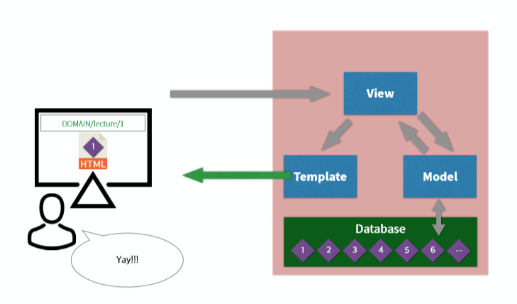
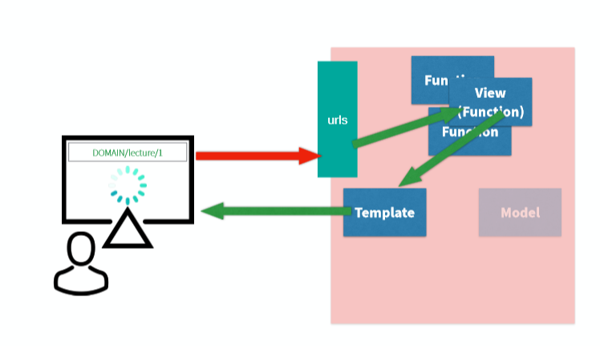
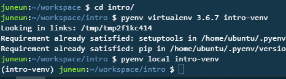
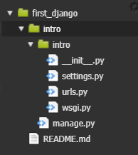

# Django






---

### **c9 project - first_django**

---

**pyenv**  : 파이썬 버전 관리 툴

**virtualenv** : 독립적인 가상의 파이썬 실행 환경

```
git clone https://github.com/pyenv/pyenv.git ~/.pyenv
echo 'export PYENV_ROOT="$HOME/.pyenv"' >> ~/.bashrc
echo 'export PATH="$PYENV_ROOT/bin:$PATH"' >> ~/.bashrc
echo -e 'if command -v pyenv 1>/dev/null 2>&1; then\n  eval "$(pyenv init -)"\nfi' >> ~/.bashrc
exec "$SHELL"                    # shell reload

git clone https://github.com/pyenv/pyenv-virtualenv.git $(pyenv root)/plugins/pyenv-virtualenv
echo 'eval "$(pyenv virtualenv-init -)"' >> ~/.bashrc
exec "$SHELL"
```

**python 3.6.7설치** : `pyenv install 3.6.7`

**python 전역에서 사용** : `pyenv global 3.6.7`

**버전 확인** : `python --version`


---

## 가상환경 만들기

`mkdir intro`

`cd intro`

`pyenv virtualenv 3.6.7 intro-venv`          가상환경 만들기

`pyenv local intro-venv`					현재 위치 가상환경 시작




**가상 환경에 장고설치** : `pip install django`

**현재 폴더에 장고 시작** : `django-admin startproject intro .`




