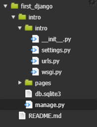
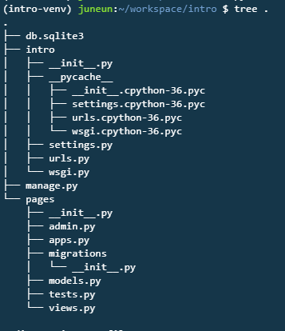
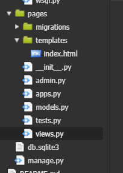
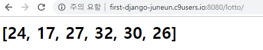
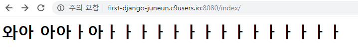
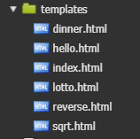

# Django

**server 실행** :  `python manage.py runserver $IP:$PORT`

### **settings.py** 

```python
# ALLOWED_HOSTS = []
ALLOWED_HOSTS = ["first-django-juneun.c9users.io"]
```

```python
#LANGUAGE_CODE = 'ko-kr'  	# 한글로
LANGUAGE_CODE = 'en-us'   # 영어로

# TIME_ZONE = 'UTC'
TIME_ZONE = 'Asia/Seoul'

USE_I18N = True  # internationalization : 국제화

INSTALLED_APPS = [
    'django.contrib.admin',
    'django.contrib.auth',
    'django.contrib.contenttypes',
    'django.contrib.sessions',
    'django.contrib.messages',
    'django.contrib.staticfiles',
    'pages.apps.PagesConfig',   # <- PagesConfig를 앱에 넣어줘야함
]
```


---

---

**pages** : `python manage.py  startapp pages`





​							 **< 템플릿 폴더 만들기 >**



**views.py**

```python
from django.shortcuts import render
import random

# Create your views here.
def index(request):
    return render(request, "index.html")
    
    
def lotto(request):
    lucky = random.sample(range(1, 46), 6)
    return render(request, "lotto.html", {'lucky': lucky})
```


**urls.py**

```python
from django.contrib import admin
from django.urls import path
from pages import views

urlpatterns = [
    # path(요청받을 url, 넘겨줄 view)
    path('admin/', admin.site.urls),
    path('index/', views.index), 
    path('lotto/', views.lotto),
]
```


**index.html**

```html
<h1>와아 아아ㅏ아ㅏㅏㅏㅏㅏㅏㅏㅏㅏㅏㅏㅏㅏㅏㅏ</h1>
```


**lotto.html**

```html
<h1>{{lucky}}</h1>
```







---

---

### 연습

**views.py**

```python
from django.shortcuts import render
import random
import math

# Create your views here.
def index(request):
    return render(request, "index.html")
    
    
def lotto(request):
    lucky = random.sample(range(1, 46), 6)
    return render(request, "lotto.html", {"lucky": lucky})
    
def hello(request, name):
    return render(request, "hello.html", {"name" : name })
    
def dinner(request):
    menu = ['짜장면','김치찌개','비빔밥','불고기','굶기']
    a = random.choice(menu)
    return render(request, "dinner.html", {"menu" : a})
    
def reverse(request, word):
    return render(request, "reverse.html", {"word" : word[::-1]})
    
def sqrt(request, num):
    a = math.sqrt(num)
    return render(request, "sqrt.html", {"num" : a})
    
```

**urls.py**

```python
from django.contrib import admin
from django.urls import path
from pages import views

urlpatterns = [
    # path(요청받을 url, 넘겨줄 view)
    path('admin/', admin.site.urls),
    path('index/', views.index), 
    path('lotto/', views.lotto),
    path('hello/<str:name>/', views.hello),
    path('dinner/', views.dinner),
    path('reverse/<str:word>/', views.reverse),
    path('sqrt/<int:num>/', views.sqrt),
]
```



```html
<h1>{{menu}}</h1>
```


