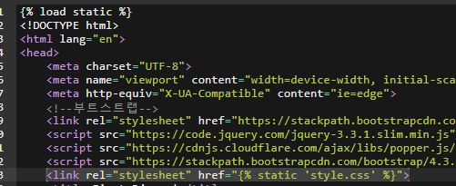
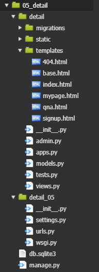

```
ㄴ$ mkdir 05_detail
$ cd 05_detail
$ pyenv virtualenv 3.6.7. detail-venv
$ pyenv local detail-venv

$ pip install django

$ django-admin startproject detail_05 .
$ python manage.py startapp detail 
```

**settings.py**

```python
ALLOWED_HOSTS = ["*"]

INSTALLED_APPS = [
    'django.contrib.admin',
    'django.contrib.auth',
    'django.contrib.contenttypes',
    'django.contrib.sessions',
    'django.contrib.messages',
    'django.contrib.staticfiles',
    'detail',
]

LANGUAGE_CODE = 'ko-kr'
```

**detail/views.py**

```python
from django.shortcuts import render

# Create your views here.
def index(request):
    return render(request, 'index.html')
```

---

# static


**base.html**   static 이미지 적용

```html

<link rel="stylesheet" href="">
```



---





---


## 404 page

**templates/404.html**

```html
{{url}}는 없는 경로입니다.
```


**views.py**

```python
def page_not_found_page(request, not_found):
    return render(request, '404.html', {"url":not_found})
```


**urls.py**

```python
urlpatterns = [
    path('admin/', admin.site.urls),
    path('', views.index),
    path('qna/', views.qna),
    path('mypage/', views.mypage),
    path('signup/', views.signup),
    path('<str:not_found>/', views.page_not_found_page),
]
```


